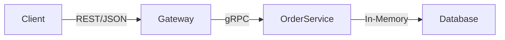

## gRPC Order Service with Go and gRPC-Gateway

A production-ready e-commerce order service with:
- gRPC microservice (HTTP/2 + Protobuf)
- RESTful JSON API gateway
- Dockerized deployment
- Koyeb cloud-ready configuration

#### 📂 Project Structure

    .
    ├── cmd/
    │   ├── server/        # gRPC server main
    │   └── client/        # Gateway server main
    ├── internal/
    │   ├── orderservice.go # Service implementation
    │   └── db.go          # Database layer
    ├── proto/             # Protocol Buffer definitions
    ├── protogen/          # Generated code
    └── docker-compose.yml # Local development

### Architecture

### 🚀 Quick Start

#### Clone the repository

    git clone https://github.com/MlondiMchunu/go-grpc.git

    cd go-grpc

#### Install dependencies

    make deps

#### Generate protobuf code

    make protoc

#### Run services

    docker-compose up -d

#### 🌐 API Endpoints

    Method	            Endpoint	        Description
    POST	            /v0/orders	        Create a new order
    GET	                /v0/orders/{id}	    Get order details
    PUT	                /v0/orders	        Update an existing order
    DELETE	            /v0/orders/{id}	    Remove an order

#### 🛠️ Development

- Build binaries

      make build
    
- Run tests

      make test
    
- Regenerate protobuf files

      make protoc

#### 📦 Deployment

1. Order Service

        docker build --target orders-service -t orders-service .

2. Gateway Service

        docker build --target gateway-service -t gateway-service .

